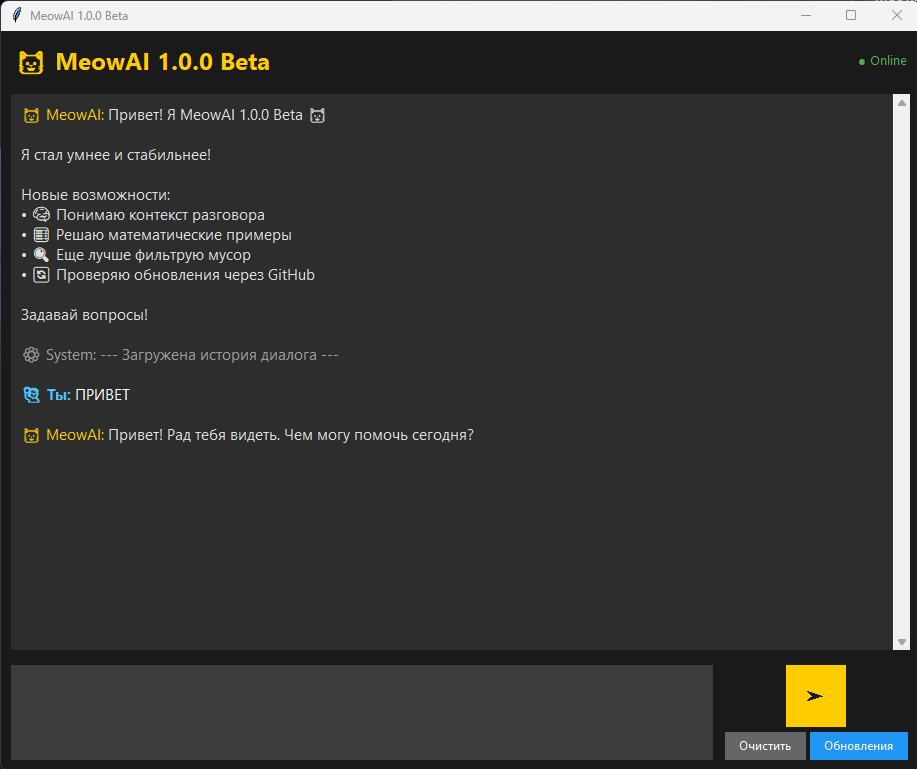

<!-- Иконки и виджеты -->

  
  
  
  
  

---

---
<h1 align="center">🐱 MeowAI — Бета-версия 1.0.0</h1>

  <strong>Умный ИИ-помощник с графическим интерфейсом, который учится, помнит ответы, решает примеры и сам проверяет обновления.</strong>

  Разработчик: <b>matvey2222222222</b>

---

## 📖 О проекте

**MeowAI** — экспериментальный ИИ-помощник. Он ищет информацию в интернете (Википедия и DuckDuckGo), анализирует её, выделяет суть и сохраняет в локальную базу знаний. При повторном запросе он уже не ищет в сети, а «вспоминает» готовый ответ.

Проект в стадии **БЕТА**, но версия **1.0.0** уже заметно стабильнее предыдущих сборок.

---

## ✨ Особенности

- **🧠 Анализ текста** — выделяет суть, а не копирует всё подряд.
- **🧹 Фильтр рекламы** — отсеивает объявления, ссылки и призывы.
- **🧮 Решение примеров** — понимает математические выражения и решает их.
- **🔄 Проверка обновлений** — проверяет наличие новых версий.
- **💾 Локальная база** — ответы сохраняются в `%APPDATA%\MeowAI`.
- **🖥️ Графический интерфейс** — тёмная тема, удобный чат.
- **📦 Готовая сборка** — распространяется как standalone-приложение, собранное через **PyInstaller**. **Python не требуется**, всё уже включено.

---

## 🆕 Что нового в 1.0.0

- **🧮 Умеет решать примеры** — простые математические выражения считает сразу, без поиска в интернете.
- **🔄 Проверка обновлений** —  при нажатии кнопки Обновления, MeowAI проверяет, вышла ли новая версия, и сообщает об этом.
- **⚡ Стабильность** — исправлены баги предыдущих версий, программа работает заметно стабильнее.
- **🧠 Улучшенный анализ** — точнее выделяет суть ответа и лучше фильтрует мусор.

---

## ⚠️ Важно (Бета-версия)

- Несмотря на версию **1.0.0**, проект всё ещё **БЕТА**. Возможны ошибки.
- Ответы могут быть неточными — **всегда проверяйте факты в первоисточниках**.
- Автор не несёт ответственности за любой ущерб от использования ПО.

---

## 📥 Скачать

Готовые сборки доступны в разделе **[Releases](https://github.com/matvey2222222222/MeowAI/releases)**.

---

## 📜 Лицензия

Проект распространяется под **кастомной лицензией MeowAI v1.0**. Кратко:

- ✅ **Можно**: использовать в личных целях, изучать, изменять для себя.
- ❌ **Нельзя**: выдавать проект за свой, распространять без указания реального автора, удалять копирайт, продавать без разрешения.

**Нарушение лицензии = жалоба в GitHub и DMCA-запрос на удаление контента.**

Полный текст — в файле [`LICENSE`](LICENSE).

---

© 2026 matvey2222222222. Сделано с 🐾 и любовью к котикам

